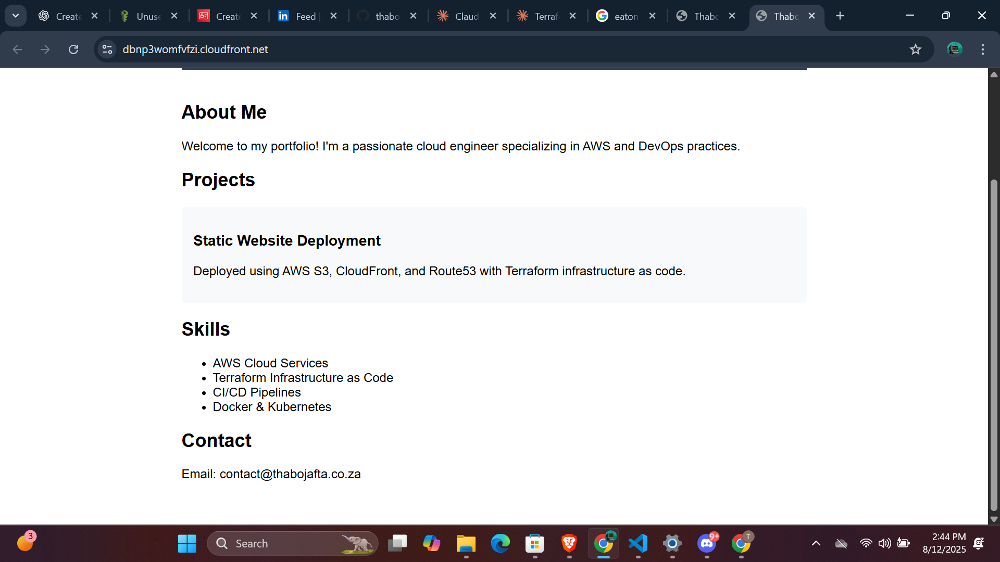
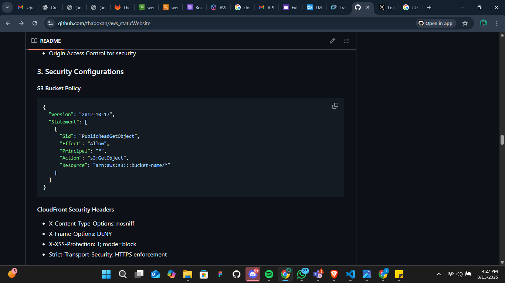
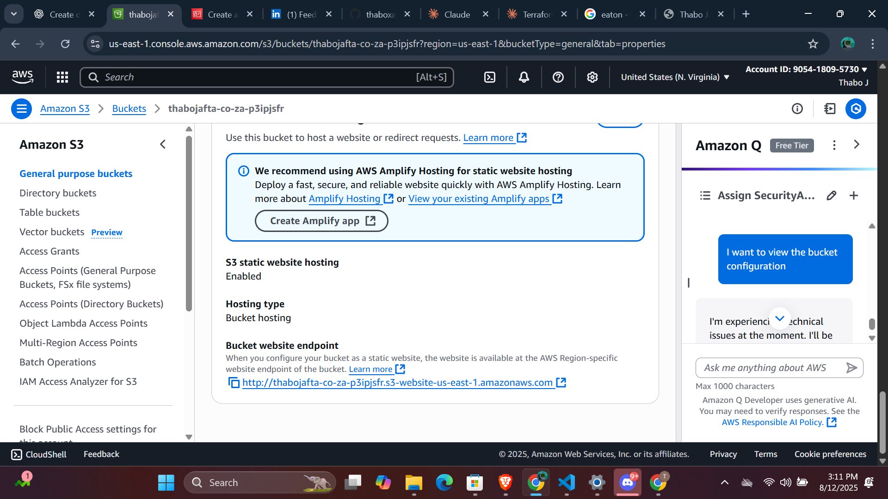
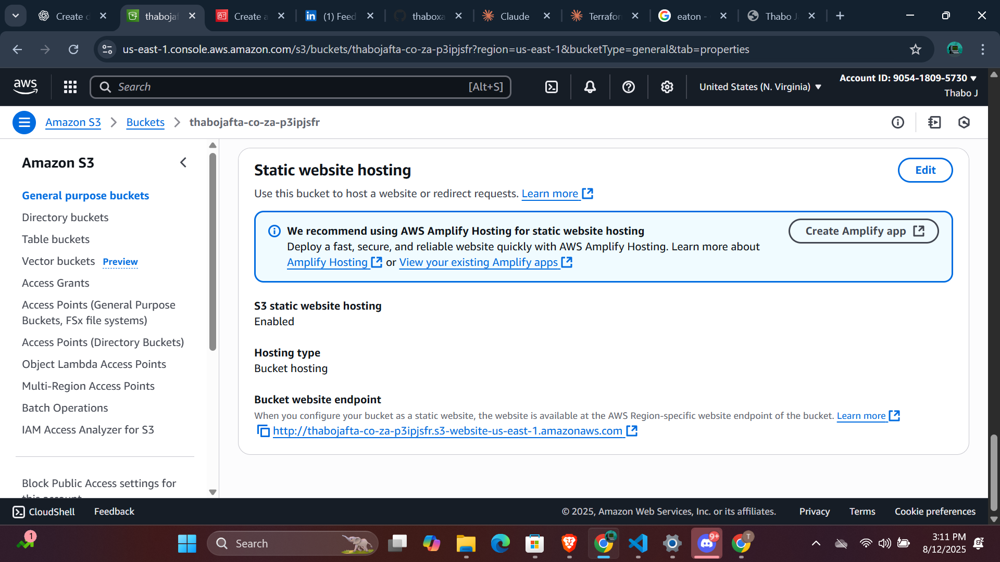
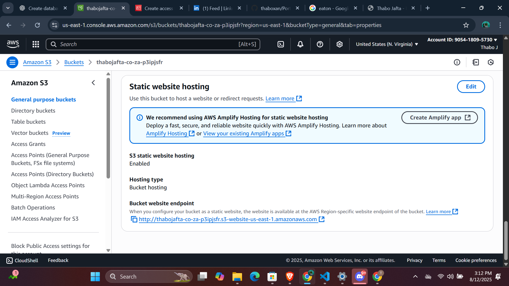
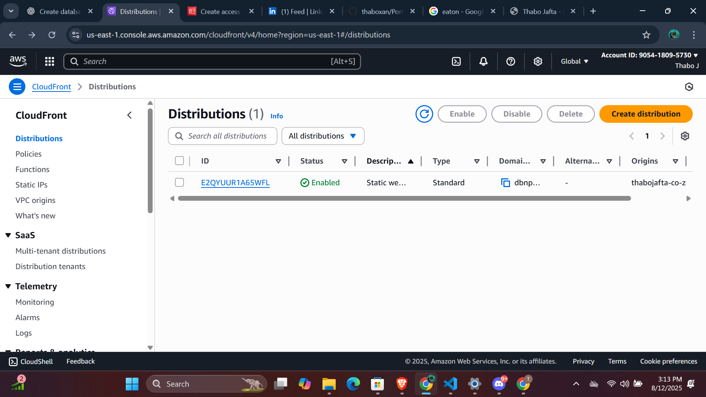

 Static Website Deployment with AWS S3 and CloudFront

## 🚀 Project Overview

This project demonstrates the deployment of a professional portfolio website using **AWS S3** for static website hosting and **CloudFront** for global content delivery. The infrastructure is provisioned using **Terraform** as Infrastructure as Code (IaC).

### 🌐 **Live Website**
**URL**: `https://dbnp3womfvfzi.cloudfront.net` (Note: May be offline if infrastructure was destroyed)

---

## 📋 Table of Contents

- [Architecture Overview](#architecture-overview)
- [Technologies Used](#technologies-used)
- [Project Structure](#project-structure)
- [Prerequisites](#prerequisites)
- [Deployment Instructions](#deployment-instructions)
- [Infrastructure Components](#infrastructure-components)
- [Security Configuration](#security-configuration)
- [Screenshots](#screenshots)
- [Cost Optimization](#cost-optimization)
- [Troubleshooting](#troubleshooting)
- [Cleanup](#cleanup)

---

## 🏗️ Architecture Overview

```
┌─────────────────┐    ┌──────────────────┐    ┌─────────────────┐
│                 │    │                  │    │                 │
│  Internet User  │───▶│  CloudFront CDN  │───▶│   S3 Bucket     │
│                 │    │                  │    │ (Static Website)│
└─────────────────┘    └──────────────────┘    └─────────────────┘
                                │
                                ▼
                       ┌──────────────────┐
                       │  Route 53 (DNS)  │
                       │   (Optional)     │
                       └──────────────────┘
```

### Key Benefits:
- **Global Performance**: CloudFront edge locations for fast content delivery worldwide
- **High Availability**: 99.99% SLA with automatic failover
- **Cost Effective**: Pay-as-you-go pricing model
- **Secure**: HTTPS encryption and access controls
- **Scalable**: Automatically handles traffic spikes

---

## 💻 Technologies Used

| Technology | Purpose | Version |
|------------|---------|---------|
| **AWS S3** | Static website hosting | Latest |
| **AWS CloudFront** | Content Delivery Network (CDN) | Latest |
| **Terraform** | Infrastructure as Code | v1.11.3 |
| **AWS CLI** | AWS command-line interface | v2.28.7 |
| **HTML5** | Website structure | - |
| **CSS3** | Website styling | - |
| **Git** | Version control | Latest |

---

## 📁 Project Structure

```
week_8/
├── README.md                    # This documentation
├── deploy.sh                    # Deployment automation script
├── terraform.tfstate           # Terraform state file
├── aws/                        # AWS CLI installation files
│   ├── install
│   ├── README.md
│   └── THIRD_PARTY_LICENSES
├── dist/                       # Built website files
│   ├── index.html              # Main portfolio HTML
│   ├── index_fixed.html        # HTML with corrected paths
│   └── assets/                 # CSS, JS, and image files
│       ├── *.css              # Stylesheet files
│       ├── *.js               # JavaScript files
│       └── *.png/*.jpg        # Image assets
├── terraform/                  # Infrastructure as Code
│   ├── main.tf                # Main Terraform configuration
│   ├── variables.tf           # Input variables
│   ├── outputs.tf             # Output values
│   ├── versions.tf            # Provider versions
│   ├── terraform.tfvars       # Variable values
│   └── terraform.tfstate      # State file
└── screenshots/               # Project documentation images
    ├── s3-bucket-configuration.png
    ├── bucket-policy.png
    ├── cloudfront-distribution.png
    ├── website-live.png
    ├── terraform-apply.png
    └── aws-resources.png
```

---

## ✅ Prerequisites

Before running this project, ensure you have:

### 1. **AWS Account**
- Active AWS account with appropriate permissions
- AWS CLI configured with access keys

### 2. **Required Tools**
```bash
# Check AWS CLI installation
aws --version
# Expected: aws-cli/2.28.7 Python/3.13.4 Windows/11 exe/AMD64

# Check Terraform installation  
terraform --version
# Expected: Terraform v1.11.3 on windows_amd64
```

### 3. **AWS Configuration**
```bash
# Configure AWS credentials
aws configure
# Enter your AWS Access Key ID
# Enter your AWS Secret Access Key  
# Default region: us-east-1
# Default output format: json

# Verify configuration
aws sts get-caller-identity
```

### 4. **Permissions Required**
Your AWS user/role needs the following permissions:
- `s3:*` (S3 full access)
- `cloudfront:*` (CloudFront full access)
- `iam:*` (IAM full access)
- `route53:*` (Route53 full access - optional)
---

## 🚀 Deployment Instructions

### Method 1: Automated Deployment (Recommended)


#### Option B: Using Bash Script
```bash
# Make script executable
chmod +x deploy.sh

# Run deployment script
./deploy.sh
```

### Method 2: Manual Step-by-Step Deployment

1. **Initialize Terraform**
   ```bash
   cd terraform
   terraform init
   ```

2. **Review Configuration**
   ```bash
   terraform validate
   terraform plan
   ```

3. **Deploy Infrastructure**
   ```bash
   terraform apply
   ```

4. **Verify Deployment**
   ```bash
   # Check S3 bucket
   aws s3 ls s3://your-bucket-name
   
   # Check CloudFront distribution
   aws cloudfront list-distributions
   ```

### Expected Deployment Time
- **S3 Resources**: 1-2 minutes
- **CloudFront Distribution**: 5-15 minutes
- **Total**: ~15-20 minutes

---

## 🏗️ Infrastructure Components

### 1. **S3 Bucket Configuration**
```hcl
resource "aws_s3_bucket" "website" {
  bucket = "${replace(var.domain_name, ".", "-")}-${random_string.bucket_suffix.result}"
  
  tags = {
    Name        = "Static Website Bucket"
    Environment = var.environment
    Purpose     = "Portfolio Website"
  }
}
```

**Features:**
- Unique bucket naming with random suffix
- Static website hosting enabled
- Versioning enabled for backup
- Public read access configured

### 2. **CloudFront Distribution**
```hcl
resource "aws_cloudfront_distribution" "website" {
  origin {
    domain_name              = aws_s3_bucket.website.bucket_regional_domain_name
    origin_access_control_id = aws_cloudfront_origin_access_control.website.id
    origin_id                = "S3-${aws_s3_bucket.website.bucket}"
  }
  
  enabled             = true
  is_ipv6_enabled     = true
  default_root_object = "index.html"
  
  # Security and performance settings
  viewer_certificate {
    cloudfront_default_certificate = true
  }
}
```

**Features:**
- Global edge locations for fast delivery
- HTTPS encryption enabled
- Gzip compression for faster loading
- Custom error pages (404 handling)
- Origin Access Control for security

### 3. **Security Configurations**

#### S3 Bucket Policy
```json
{
  "Version": "2012-10-17",
  "Statement": [
    {
      "Sid": "PublicReadGetObject",
      "Effect": "Allow",
      "Principal": "*",
      "Action": "s3:GetObject",
      "Resource": "arn:aws:s3:::bucket-name/*"
    }
  ]
}
```

#### CloudFront Security Headers
- X-Content-Type-Options: nosniff
- X-Frame-Options: DENY
- X-XSS-Protection: 1; mode=block
- Strict-Transport-Security: HTTPS enforcement

---

## 🔒 Security Configuration

### 1. **Access Control**
- **Origin Access Control (OAC)**: Restricts direct S3 access
- **Bucket Policy**: Allows public read access for website content
- **CloudFront**: Only entry point for users

### 2. **Encryption**
- **In Transit**: HTTPS/TLS 1.2+ encryption
- **At Rest**: S3 server-side encryption (AES-256)

### 3. **Best Practices Implemented**
- ✅ No public write access to S3
- ✅ CloudFront as single point of entry
- ✅ Custom error pages for better UX
- ✅ Proper MIME types for all assets
- ✅ Versioning enabled for recovery

---

## 📸 Screenshots

### 1. S3 Bucket Configuration

*Shows S3 bucket with static website hosting enabled and proper configuration*

### 2. Bucket Policy Configuration  

*Displays the public read access policy for website content*

### 3. CloudFront Distribution

*CloudFront distribution configuration with origin settings*

### 4. Live Website

*Professional portfolio website running live via CloudFront*

### 5. Terraform Apply Success

*Successful infrastructure deployment showing all created resources*

### 6. AWS Resources Overview

*AWS console showing all deployed resources and their status*

---

## 💰 Cost Optimization

### Cost Breakdown (Estimated Monthly)
| Service | Usage | Estimated Cost |
|---------|--------|----------------|
| **S3 Storage** | ~100MB website files | $0.02 |
| **S3 Requests** | ~1,000 GET requests | $0.01 |
| **CloudFront** | ~1GB data transfer | $0.09 |
| **CloudFront Requests** | ~10,000 requests | $0.01 |
| **Total** | | **~$0.13/month** |

### Cost Optimization Strategies:
1. **S3 Intelligent Tiering**: Automatically moves files to cheaper storage classes
2. **CloudFront Caching**: Reduces origin requests with longer TTL
3. **Gzip Compression**: Reduces bandwidth costs
4. **Price Class 100**: Uses only North America and Europe edge locations

---

## 🔧 Troubleshooting

### Common Issues and Solutions

#### 1. **Terraform Plan Fails**
```bash
# Error: Saved plan is stale
Solution: Create a new plan
terraform plan -out=tfplan
terraform apply tfplan
```

#### 2. **S3 Bucket Access Denied**
```bash
# Check bucket policy
aws s3api get-bucket-policy --bucket your-bucket-name

# Fix: Ensure public read access is enabled
```

#### 3. **CloudFront 404 Errors**
- **Cause**: Incorrect default root object
- **Solution**: Ensure `index.html` is set as default root object

#### 4. **CSS/JS Not Loading**
- **Cause**: Incorrect MIME types or file paths
- **Solution**: Check file paths and ensure proper content-type headers

#### 5. **Website Not Accessible**
- **Cause**: CloudFront distribution not fully deployed
- **Solution**: Wait 10-15 minutes for global propagation

### Debug Commands
```bash
# Check Terraform state
terraform show

# Verify S3 bucket contents
aws s3 ls s3://your-bucket-name --recursive

# Check CloudFront distribution status  
aws cloudfront get-distribution --id YOUR_DISTRIBUTION_ID

# Test website accessibility
curl -I https://your-cloudfront-domain.cloudfront.net
```

---

## 🧹 Cleanup

### To Remove All Infrastructure:
```bash
# Navigate to terraform directory
cd terraform

# Destroy all resources
terraform destroy

# Confirm with 'yes' when prompted
```

### Manual Cleanup (if needed):
1. **Empty S3 bucket**: Delete all objects first
2. **Delete CloudFront distribution**: Disable, then delete (takes ~15 minutes)
3. **Remove S3 bucket**: Delete after CloudFront removal
4. **Clean up DNS records**: If Route53 was configured

### Cleanup Verification:
```bash
# Check S3 buckets
aws s3 ls

# Check CloudFront distributions
aws cloudfront list-distributions

# Verify no remaining resources
terraform show
```

---

## 📚 Additional Resources

### Documentation Links:
- [AWS S3 Static Website Hosting](https://docs.aws.amazon.com/AmazonS3/latest/userguide/WebsiteHosting.html)
- [AWS CloudFront Documentation](https://docs.aws.amazon.com/cloudfront/)
- [Terraform AWS Provider](https://registry.terraform.io/providers/hashicorp/aws/latest/docs)

### Related Projects:
- [Week 7: Container Deployment](../week_7/README.md)
- [Week 9: CI/CD Pipeline](../week_9/README.md)

---

## 👨‍💻 About

**Developer**: Thabo Jafta  
**Role**: DevOps Engineering Intern  
**Company**: Wipro x Capaciti  
**Project**: Week 8 - Static Website Deployment  
**Date**: August 2025  

### Skills Demonstrated:
- ☑️ AWS S3 static website hosting
- ☑️ CloudFront CDN configuration  
- ☑️ Terraform Infrastructure as Code
- ☑️ Security best practices
- ☑️ Cost optimization strategies
- ☑️ Professional documentation

### Connect:
- **GitHub**: [@thaboxan](https://github.com/thaboxan)
- **LinkedIn**: [Thabo Jafta](https://www.linkedin.com/in/thabojafta1/)
- **Portfolio**: [Live Website](https://dbnp3womfvfzi.cloudfront.net)

---

## 📝 Project Status

- ✅ **Infrastructure Code**: Complete
- ✅ **S3 Configuration**: Complete  
- ✅ **CloudFront Setup**: Complete
- ✅ **Security Implementation**: Complete
- ✅ **Website Deployment**: Complete
- ✅ **Documentation**: Complete
- ⚠️ **Current Status**: Infrastructure may be destroyed (run `terraform apply` to redeploy)

---

*This project successfully demonstrates the deployment of a professional portfolio website using AWS S3 and CloudFront, showcasing modern DevOps practices and cloud infrastructure management.*

